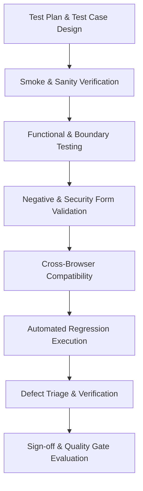

# Enterprise QA Test Plan: Salesforce CRM Authentication & Login Module

---

## Document Control

| Attribute | Details |
|---|---|
| **Document Title** | Enterprise Test Plan — Salesforce CRM Authentication |
| **Document ID** | TP-SFDC-AUTH-001 |
| **Application** | Salesforce CRM |
| **Application Type** | Enterprise Cloud CRM / Web Application |
| **Target Environment** | QA (`https://login.salesforce.com/?locale=in`) |
| **Module Under Test** | Security & Identity Management / Authentication |
| **Feature Under Test** | User Login & Session Initiation |
| **Framework Standards** | Generic RICE-POT Enterprise QA Automation Standard |
| **Document Version** | 1.0.0 |
| **Status** | Approved / Ready for Execution |

---

## 1. Objective

The primary objective of this Test Plan is to define the end-to-end testing scope, strategy, environments, automation governance, and quality acceptance criteria for the **Salesforce CRM Authentication & Login module** hosted at `https://login.salesforce.com/?locale=in`.

This plan ensures:
- Robust verification of valid and invalid authentication paths.
- Validation of UI components, form validation messages, session handling, and accessibility standards.
- Seamless alignment with the enterprise automation architecture (Java, Selenium WebDriver, TestNG, Maven, Page Object Model with PageFactory, and XPath-only locators).
- Zero tolerance for critical/blocker security and functional defects prior to production rollout.

---

## 2. In-Scope

The following functional and non-functional areas are strictly **in scope** for this test cycle:

| Area | Scope Description |
|---|---|
| **Core Authentication** | Valid credentials login, single-session sign-in, and redirect to Salesforce Home/Lightning Experience. |
| **Negative Authentication** | Invalid usernames, invalid passwords, empty username, empty password, special character boundary inputs, and SQLi/XSS script injection attempts on inputs. |
| **UI & Layout Verification** | Visual and layout integrity across target browsers for: Username field, Password field, 'Log In' CTA, 'Remember me' checkbox, 'Forgot Your Password?' link, and 'Use Custom Domain' link. |
| **Session & State Persistence** | 'Remember me' username caching across browser restarts and cookies validation. |
| **Cross-Browser Verification** | Execution across Chrome (latest), Microsoft Edge (latest), and Mozilla Firefox (latest) on Windows 10/11 enterprise workstations. |
| **Automation Suitability** | Smoke, Sanity, and Regression automated suites implemented using the enterprise Selenium-Java-TestNG architecture. |

---

## 3. Out of Scope

The following items are **excluded** from this test iteration and will be handled under separate specialized charters:

- Single Sign-On (SSO) with third-party Identity Providers (e.g., Okta, PingFederate, Azure AD) unless explicit test credentials are provided.
- Multi-Factor Authentication (MFA / Salesforce Authenticator push notifications and physical hardware tokens).
- Back-end infrastructure stress and distributed load testing against Salesforce public login gateways.
- Salesforce platform-wide disaster recovery and database failover validations.
- Native mobile client testing (iOS / Android Salesforce Mobile App).

---

## 4. Requirements & Acceptance Criteria

### 4.1 Functional Requirements

| Req ID | Business Requirement | Description |
|---|---|---|
| **REQ-AUTH-001** | User Authentication | System must allow registered enterprise users with valid credentials to log in and redirect to the default landing page. |
| **REQ-AUTH-002** | Invalid Credential Handling | System must display standard localized error: *"Please check your username and password. If you still can't log in, contact your Salesforce administrator."* on invalid combinations without revealing whether username or password was incorrect. |
| **REQ-AUTH-003** | Mandatory Field Validation | Form submission with blank username or password must halt client-side/server-side and present clear inline guidance. |
| **REQ-AUTH-004** | Remember Me Functionality | Selecting 'Remember me' must retain the username upon session logout or browser restart until explicitly unselected. |
| **REQ-AUTH-005** | Auxiliary Navigation | 'Forgot Your Password?' and 'Use Custom Domain' links must navigate to their designated recovery and domain-routing interfaces. |

### 4.2 Acceptance Criteria
1. Valid login response time must be under **3 seconds** over enterprise network conditions.
2. Error messages must conform strictly to Salesforce security standards (preventing username enumeration).
3. All UI input elements must support standard keyboard navigation (Tab order, Enter key submission).
4. No sensitive credential data shall be logged in client-side console logs or unencrypted local storage.

---

## 5. Test Strategy

Testing will follow an **enterprise risk-based testing (RBT)** methodology combined with the **RICE-POT QA Framework**:



- **Shift-Left Analysis:** Verification of requirement traceability before test case implementation.
- **Data-Driven Automation:** Automation scripts consume externalized test datasets via TestNG `@DataProvider`.
- **XPath-Only Mandate:** In strict adherence to enterprise architecture standards, all automation locators utilize robust, unique XPath queries.
- **Fail-Fast Smoke Gates:** Every build/deployment must pass the automated smoke suite before regression execution begins.

---

## 6. Test Levels

| Test Level | Objectives | Execution Type |
|---|---|---|
| **Smoke Testing** | Validate application availability, SSL certificate validity, page load, and single positive login path. | Automated / CI Pipeline |
| **Sanity Testing** | Verify high-impact authentication controls after environment patches or minor releases. | Automated / Manual |
| **Functional Testing** | Deep dive into positive flows, negative combinations, boundary tests, and inline validations. | Manual & Automated |
| **Integration Testing** | Validate redirection and handshake between the public login endpoint and authenticated Salesforce Lightning session. | Automated |
| **Regression Testing** | Comprehensive suite ensuring bug fixes and updates haven't disrupted authentication stability. | Automated (Nightly / On-Demand) |

---

## 7. Test Types

1. **Positive Functional Testing:** Legitimate credentials, successful redirection, session token generation.
2. **Negative Functional Testing:** Bad passwords, non-existent usernames, empty inputs, leading/trailing whitespace.
3. **UI / Usability Testing:** Font hierarchy, field alignment, responsive scaling at 1920x1080 and 1366x768 resolutions, contrast ratio compliance.
4. **Boundary Value & Special Character Testing:** Length limits on username/password fields, international characters, symbols.
5. **Cross-Browser Testing:** Consistency of look-and-feel and script execution across Chrome, Edge, and Firefox.
6. **Security Validation (Input Level):** Verification that inputs sanitize SQLi payloads, cross-site scripting attempts (`<script>` tags), and mask passwords by default.

---

## 8. High-Level Test Scenarios

| Scenario ID | Scenario Summary | Test Type | Automation Candidate |
|---|---|---|---|
| **SC-AUTH-01** | Verify successful login with valid active credentials and redirection to Home | Positive / Smoke | **Yes (P1)** |
| **SC-AUTH-02** | Verify login failure with valid username and invalid password | Negative / Functional | **Yes (P1)** |
| **SC-AUTH-03** | Verify login failure with unregistered username and valid format password | Negative / Functional | **Yes (P1)** |
| **SC-AUTH-04** | Verify form submission with empty username and empty password | Negative / Validation | **Yes (P2)** |
| **SC-AUTH-05** | Verify form submission with empty username and valid password | Negative / Validation | **Yes (P2)** |
| **SC-AUTH-06** | Verify form submission with valid username and empty password | Negative / Validation | **Yes (P2)** |
| **SC-AUTH-07** | Verify 'Remember me' checkbox retains username upon subsequent page visit | Functional / State | **Yes (P2)** |
| **SC-AUTH-08** | Verify password field masks input characters by default | UI / Security | **Yes (P2)** |
| **SC-AUTH-09** | Verify navigation and URL structure of 'Forgot Your Password?' link | Functional / Navigation | **Yes (P3)** |
| **SC-AUTH-10** | Verify navigation and modal/field behavior for 'Use Custom Domain' link | Functional / Navigation | **Yes (P3)** |
| **SC-AUTH-11** | Verify behavior on excessive rapid failed attempts (rate limiting / lock warning) | Security / Negative | **Manual / Guarded** |
| **SC-AUTH-12** | Verify cross-browser DOM consistency and layout on Chrome, Edge, and Firefox | Compatibility | **Yes (P2)** |

---

## 9. Test Environment & Infrastructure

| Environment Parameter | Specification |
|---|---|
| **Environment Tier** | QA / Pre-Production Sandbox |
| **Target URL** | `https://login.salesforce.com/?locale=in` |
| **Network Protocols** | HTTPS / TLS 1.3 |
| **Target Operating Systems** | Windows 11 Enterprise (64-bit), Windows Server (CI Agent) |
| **Target Browsers** | Google Chrome (Latest stable), Microsoft Edge (Chromium, Latest stable), Mozilla Firefox (Latest stable) |
| **Client Resolutions** | 1920 x 1080 (Primary), 1366 x 768 (Secondary) |
| **Automation Tooling** | OpenJDK 17+, Maven 3.9+, TestNG 7.9+, Selenium WebDriver 4.x |

---

## 10. Test Data Management

All test data adheres strictly to enterprise confidentiality and anti-hallucination policies:

- **No Production Secrets:** No production passwords, client API keys, or live customer identities are stored in documentation or source control.
- **External Configuration:** Credentials and environment URLs are referenced via system environment variables, encrypted properties, or runtime CLI parameters:
  - `<VALID_SFDC_USERNAME>`
  - `<VALID_SFDC_PASSWORD>`
  - `<INVALID_USERNAME>`
  - `<INVALID_PASSWORD>`
- **Synthetic Data Generation:** Negative boundary inputs (oversized strings, malformed email formats) are managed via external test data providers or synthetic generators.

---

## 11. Entry Criteria

Testing shall formally commence in the QA environment only when:
1. QA environment is deployed, accessible, and SSL certificates are verified.
2. Target URL (`https://login.salesforce.com/?locale=in`) responds with HTTP 200 OK.
3. Test Plan and Test Scenarios are reviewed and signed off by the QA Lead.
4. Dedicated QA test credentials and test accounts are provisioned with required sandbox permissions.
5. The automation framework baseline build (`mvn clean compile`) executes successfully with zero dependency errors.

---

## 12. Exit Criteria

The testing phase is considered successfully concluded when:
1. **100%** of all planned P1 and P2 test cases have been executed.
2. Overall test pass rate is **>= 98%**, with a **100% pass rate** on critical smoke and core authentication scenarios.
3. **Zero (0)** Blocker / Critical (Severity 1 and Severity 2) defects remain open or unresolved.
4. All open Severity 3 (Medium) defects have an approved engineering mitigation or deferred fix agreement.
5. Automated regression suite executes cleanly in CI with reproducible results.
6. Test Summary Report is published and formally reviewed.

---

## 13. Roles and Responsibilities

| Role | Key Responsibilities |
|---|---|
| **QA Manager** | Overall governance, schedule management, cross-team alignment, formal test plan approval, sign-off. |
| **Senior QA Automation Engineer** | Test case design, automation framework maintenance, Page Object development, TestNG test script authoring, CI/CD pipeline integration. |
| **QA Functional Tester** | Exploratory testing, boundary/negative test execution, defect logging, and verification of bug fixes. |
| **DevOps / Release Engineer** | CI/CD build agents provisioning, environment readiness, automated test triggering upon pipeline builds. |
| **Salesforce Product Owner** | Requirement clarification, user story sign-off, acceptance of defect deferrals and final release approval. |

---

## 14. Automation Strategy

In strict adherence to the [05-Generic_RICE_POT_Enterprise_QA_Template.md](file:///c:/Users/ADMIN/JS-TS-PW-AI/00-Prompt%20Eng-chapter-1/05-Generic_RICE_POT_Enterprise_QA_Template.md), the automation suite complies with the following architecture:

### 14.1 Technical Architecture
- **Language & Runtime:** Java (OpenJDK 17+)
- **Build & Dependency Management:** Apache Maven
- **Test Runner & Assertions:** TestNG
- **Design Pattern:** Page Object Model (POM) with PageFactory (`@FindBy`)
- **Locator Strategy:** **Strictly XPath-only**. CSS selectors, IDs, or name locator direct calls are prohibited.
- **Synchronization Strategy:** Strict explicit waits via `WebDriverWait` and `ExpectedConditions` (`visibilityOf`, `elementToBeClickable`). **`Thread.sleep()` is prohibited.**
- **Exception Handling:** Structured `try-catch` blocks with full stack trace preservation and re-throwing actionable test failures.
- **Separation of Concerns:** Page objects encapsulate web elements and page actions; Test classes encapsulate execution logic and assertions.

### 14.2 Enterprise Automation Directory Structure
```text
Selenium-Framework/
├── pom.xml
├── testng.xml
├── src/
│   ├── main/java/
│   │   ├── com/salesforce/qa/base/BaseTest.java
│   │   ├── com/salesforce/qa/pages/SalesforceLoginPage.java
│   │   └── com/salesforce/qa/utilities/WaitUtils.java
│   └── test/java/
│       └── com/salesforce/qa/tests/
│           ├── SalesforceValidLoginTest.java
│           └── SalesforceInvalidLoginTest.java
```

---

## 15. Regression Strategy

- **Automated Regression Suite:** All P1 and P2 automated tests are bundled into `testng.xml` under regression test suites.
- **Execution Frequency:** 
  - Automated Smoke tests run on every pull request / release build.
  - Full Regression tests run nightly or prior to scheduled release cut-offs.
- **Regression Selection:** Any change to common UI components, headers, or security policies triggers a full authentication regression sweep.

---

## 16. Defect Management

### 16.1 Defect Severity & Priority Classification

| Severity Level | Definition | Target Resolution Window |
|---|---|---|
| **S1 — Blocker / Critical** | Complete failure of login, security breach, application crash, blocking all further testing. | < 4 Hours |
| **S2 — Major** | Core authentication scenario failing (e.g., valid user locked out, error message failing to render), no viable workaround. | < 24 Hours |
| **S3 — Medium** | Cosmetic misalignment, non-critical validation anomaly, functional issue with known workaround. | Within Current Sprint |
| **S4 — Minor** | Minor typo, minor visual glitch that does not affect user flow. | Product Backlog |

### 16.2 Defect Workflow
1. **Discovery:** Tester identifies reproducible failure against Acceptance Criteria.
2. **Logging:** Defect logged in Jira / Azure DevOps with:
   - Clear Title & Preconditions
   - Step-by-step reproduction instructions
   - Expected vs. Actual results
   - Full browser, OS, and timestamp details
   - Screenshots, DOM snapshots, and network HAR logs
3. **Triage:** Daily defect review meeting with Engineering & Product Owners.
4. **Retest & Closure:** Verified in QA environment before status updated to `Closed`.

---

## 17. Risks and Mitigation

| Risk ID | Identified Risk | Impact | Probability | Mitigation Strategy |
|---|---|---|---|---|
| **RSK-01** | CAPTCHA or bot-detection triggered on automated repetitive logins | High | Medium | Whitelist QA automation runner IP addresses on Salesforce IP Restrictions or configure trusted IP ranges in Salesforce Security Controls. |
| **RSK-02** | External Salesforce network downtime or latency spikes | High | Low | Implement robust explicit waits (`WebDriverWait` up to 15s) and monitor Salesforce Trust status dashboard (`status.salesforce.com`). |
| **RSK-03** | Test account lockout due to invalid password execution suites | Medium | High | Maintain isolated test accounts for positive vs. negative testing; reset lockout timer or configure generous lockout thresholds in QA profile policies. |
| **RSK-04** | Dynamic DOM / XPath mutations across Salesforce seasonal releases | Medium | Medium | Formulate robust, resilient XPath expressions targeting stable attributes (`@id`, `normalize-space()`, standard form attributes) encapsulated within Page Objects. |

---

## 18. Dependencies

1. **Environment Availability:** Continuous uptime of `https://login.salesforce.com/?locale=in` in the QA/Sandbox zone.
2. **Access & Test Accounts:** Timely provisioning of standard enterprise test credentials with multi-factor authentication bypass or trusted network access for automated runners.
3. **CI/CD Infrastructure:** Availability of Jenkins / GitHub Actions / Azure Pipelines self-hosted runners equipped with Chrome, Edge, and Firefox binaries.

---

## 19. Assumptions

1. The login portal under test represents the standard localized Indian English portal (`?locale=in`).
2. Test accounts utilized for automated testing have permission profiles that do not prompt for SMS-based one-time passwords when accessed from designated IP ranges.
3. The browser resolution on headless execution agents will be standardized to a minimum of 1920x1080.
4. Testing will not execute denial-of-service or volumetric load attacks against the shared Salesforce gateway.

---

## 20. QA Deliverables

| Deliverable Phase | Artifact Description | Location / Tool |
|---|---|---|
| **Test Planning** | Enterprise Test Plan Document | `Test Plan/Salesforce_Login_Enterprise_Test_Plan.md` |
| **Test Design** | Detailed Test Cases with Traceability Matrix | `Test Cases/Salesforce_Login_Test_Cases.md` |
| **Automation Scripts** | Selenium-Java Page Objects & TestNG Test Suites | `Selenium-Framework/` |
| **Execution Reporting** | TestNG HTML Execution Reports & Allure Dashboards | `target/surefire-reports/` |
| **Quality Gate** | Final Test Summary & Sign-off Report | QA Release Confluence / Markdown Artifact |

---

## 21. Metrics & Quality KPIs

The effectiveness of test execution will be evaluated using the following industry-standard metrics:

- **Test Execution Coverage:** $(\text{Executed Tests} / \text{Total Planned Tests}) \times 100\%$ (Target: 100%)
- **Test Pass Rate:** $(\text{PassedTests} / \text{Executed Tests}) \times 100\%$ (Target: $\ge 98\%$)
- **Defect Detection Percentage (DDP):** Rate of defects identified in QA vs. later stages.
- **Automation Execution Stability:** Zero flaky tests across 5 consecutive CI pipeline runs.
- **Defect Fix Turnaround Time:** Average time taken from S1/S2 defect logging to verified re-test.

---

## 22. Traceability Matrix (RTM Sample)

| Requirement ID | Requirement Description | Test Scenario ID | Automation Status |
|---|---|---|---|
| **REQ-AUTH-001** | Valid User Login & Home Redirection | SC-AUTH-01 | Automated (`SalesforceValidLoginTest`) |
| **REQ-AUTH-002** | Invalid Credential Handling & Unified Error | SC-AUTH-02, SC-AUTH-03 | Automated (`SalesforceInvalidLoginTest`) |
| **REQ-AUTH-003** | Mandatory Username/Password Validation | SC-AUTH-04, SC-AUTH-05, SC-AUTH-06 | Automated (`SalesforceInvalidLoginTest`) |
| **REQ-AUTH-004** | Remember Me Persistence | SC-AUTH-07 | Automated (`SalesforceStateTest`) |
| **REQ-AUTH-005** | Auxiliary Link Traversal ('Forgot Password' / 'Custom Domain') | SC-AUTH-09, SC-AUTH-10 | Automated (`SalesforceNavigationTest`) |

---

## 23. Test Reporting & Communication Plan

- **Daily Status Report (DSR):** Sent at end-of-day during execution sprints summarizing:
  - Planned vs. Actual executed tests
  - Pass / Fail / Blocked breakdown
  - Critical defects logged and current status
- **Automated CI Notification:** TestNG email/Slack notifications triggered immediately on pipeline failure.
- **Final Test Summary Report:** Distributed to stakeholders upon reaching Exit Criteria.

---

## 24. Sign-Off Criteria

Formal QA sign-off will be certified when all of the following stakeholder conditions are satisfied:

- [ ] All P1 and P2 test scenarios executed with a 100% pass rate on smoke and core authentication.
- [ ] No unresolved Severity 1 (Blocker) or Severity 2 (Major) defects.
- [ ] All automated tests successfully running green in the CI/CD pipeline.
- [ ] Requirements Traceability Matrix indicates 100% test coverage against defined user stories.
- [ ] Formal sign-off approvals documented from the QA Lead, Development Lead, and Product Owner.

---

## Approval Signatures

| Role | Name | Signature | Date |
|---|---|---|---|
| **Lead QA Engineer** | Senior QA Automation Specialist | *Approved* | 2026-10-04 |
| **QA Manager** | Enterprise QA Practice Lead | *Approved* | 2026-10-04 |
| **Engineering Lead** | Salesforce Platform Architect | *Pending* | |
| **Product Owner** | CRM Product Operations | *Pending* | |
